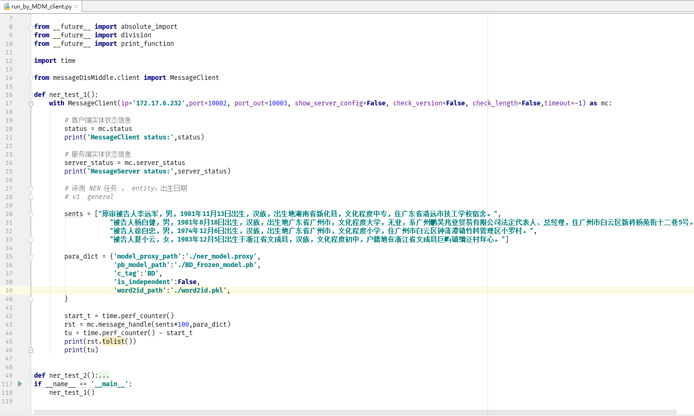

# messageDisMiddle
消息分发中间件说明书

该消息分发中间件（Message Distribution Middleware,
MDM）主要可用来处理模型推理时数据分发并行处理工作。将数据切分成多个数据块同时分发到多个工作节点进行并行的模型推理作业。

MDM针对单机环境下机器学习或深度学习模型推理大批量数据集时单线程，IO耗时较长的缺陷，采用Client/Server
模式和ZeroMQ并行流水操作，对数据集分而治之，缩短了单次推理请求的耗时。服务启动后，服务调用者将数据和模型参数输入客户端，MDM在服务端将数据分发到多个worker节点，处理，合并结果，最后将结果返回给客户端调用者。MDM架构的图示如下：

接下来从安装，启动，使用方法三个方面来介绍MDM。

1.安装
------

在windows 或 linux下使用pip 安装：

pip install messageDisMiddle-0.0.1.tar.gz

2. 启动
-------

安装完MDM的 python包之后，使用CLI 命令启动MDM服务或关闭服务。

### （1）启动MDM:

MDM-server-start \\

–num_worker=4 \\

\-device_map=-1 \\

\-port=5555 \\

\-port_out=5556 \\

\-run_script_dir=/workspace/devspace/messageDisMiddle/messageDisMiddle/example

… …

相关参数说明如下：

| 参数键                    | 参数值类型 | 默认参数值    | 说明                                                                                                                                                                                        |
|---------------------------|------------|---------------|---------------------------------------------------------------------------------------------------------------------------------------------------------------------------------------------|
| \-zeromq_sock_tmp_dir     | str        | None          | zeromq通信产生的临时文件存放地址，如果不指定，系统会在当前目录新建sock_tmp文件夹存放临时文件。                                                                                              |
| \-run_script_dir          | str        | ./            | 存放具体模型的实现类python脚本的文件夹。需要启动服务时指定，否则，默认为当前目录。                                                                                                          |
| \-logger                  | str        | ./logger.txt  | log文件地址，默认为当前目录新建日志文件。                                                                                                                                                   |
| \-port/-port_in/port_data | int        | 5555          | tcp服务service端口                                                                                                                                                                          |
| \-port_out/-port_result/  | int        | 5556          | tcp服务client端口                                                                                                                                                                           |
| \-num_worker              | int        | 1             | worker个数,并行异步执行请求的worker个数。                                                                                                                                                   |
| \-max_batch_size          | int        | 1024          | 每一个worker处理的批次数据大小                                                                                                                                                              |
| \-priority_batch_size     | int        | 16            | 每次请求的数据大小优先分配worker的阈值                                                                                                                                                      |
| \-gpu_memory_fraction     | float      | 0.2           | 占用GPU内存容量的比例大小，[0.0,1.0]                                                                                                                                                        |
| \-device_map              | str        | \-1           | 指定使用的计算设备编号， 默认-1表示只使用cpu。使用0指定使用第一块GPU设备，如果有多块GPU设备，可使用英文逗号连接GPU编号组成字符串。如：有0和1两块GPU，使用‘0,1’指定同时两块GPU在服务中可用。 |
| \-verbose                 | bool       | False(不指定) | 打印tf logging info debug                                                                                                                                                                   |

操作示例：

其中-num_worker
指定工作节点个数，个数越多并行处理的批数据越多，-device_map指定了计算设备的编号，-port
指定服务端的端口号，-port_out 指定客户端的端口号，-run_script_dir
指定实际实现模型的python脚本所在的文件夹路径。

启动成功：

### （2）关闭服务

MDM-server-terminate -port=5555

参数说明：

| 参数键                     | 参数值类型 | 默认参数值 | 说明                   |
|----------------------------|------------|------------|------------------------|
| \-ip                       | str        | localhost  | 服务端host             |
| \-timeout                  | int        | 5000       | 超时时间               |
| \-port/-port_in/-port_data | int        | int        | 服务端端口号，必须指定 |

操作示例：

结果：

服务端日志显示：

此时，服务被关闭了。

3.使用方法与示例
----------------

在前面安装好messageDisMiddle
包之后，想要调用MDM服务，首先必须继承messageDisMiddle.run_script.model类，在子类中实现dump()和inference()方法。其中实现的inference()方法中包含了具体的模型推理调用逻辑和传入该方法的推理参数，推理参数包括数据和模型配置参数两部分。且这里的推理参数应该和调用MDM客户端方法传入的参数是一样的。此外，推理参数中必须含有键为‘model_proxy_path’的键值数据。当实现了model类中两个抽象方法后，使用dump()
方法持久化实现类的对象生成模型对象的代理文件abc.proxy。该模型代理文件的路径就是‘model_proxy_path’的值。

至此，我们有了模型实现类的python脚本和模型对象代理文件abc.proxy。其中模型实现类的python脚本应该放入MDM服务启动时参数-run_script_dir指定的路径下，这样MDM服务端才能根据客户端传入的模型代理文件去run_script_dir路径下加载模型实现类，再调用实现的inference()方法返回推理结果。其他自定义文件随意。

最后，调用MDM客户端方法传入数据和参数。这里传入的参数包含了键为‘model_proxy_path’的模型代理文件键值对数据，以及模型实现脚本中需要用到的的参数。

注意：表示文件路径的参数的键尽量使用‘_path’结尾。这样系统才能检查路径的有效性。

举个栗子：

假设我构建好了一个深度学习NER模型，准备好了相关的资源文件。想要采用MDM服务进行inference。会有以下几个步骤：

1.编写模型实现类的python脚本。

2.编写生成模型代理文件的python脚本并执行生成模型代理文件。

3.配置好启动参数项，启动MDM服务，将model_impl_ner.py放入服务配置项
-run_script_dir指定的文件夹中。

4.调用客户端，传入数据和参数了，使用MDM服务。

5.执行调用逻辑脚本，返回结果。

例子中相关的文件列表如下 相关脚本在example文件夹中：

4.时耗测试
----------

使用上面例子的NER模型，对同一批数据在不同的配置下进行时耗(单位秒)对比测试，每批测试数据的数目分别为：[400,
800, 1200, 1600, 2000, 2400, 2800, 3200, 3600, 4000, 4400, 4800, 5200, 5600,
6000, 6400, 6800, 7200, 7600,
8000]。测试时，服务的参数配置除了device_map和num_worker不同外，其他服务参数不变。结果如下：

4.1 都只使用cpu，worker数量分别为1（红色），4（蓝色）的两次测试时耗对比如下：

4.2都只使用cpu，worker数量分别为1（红色），4（蓝色），8（绿色）的三次测试时耗对比如下：

4.3分别使用cpu（红色）和gpu（绿色），worker数量为1的两次测试时耗对比如下：

4.4都只使用gpu，worker数量分别为1（红色），4（绿色）的两次测试时耗对比如下

4.5都只使用gpu，worker数量分别为1（红色），4（蓝色），8（绿色）的三次测试时耗对比如下

